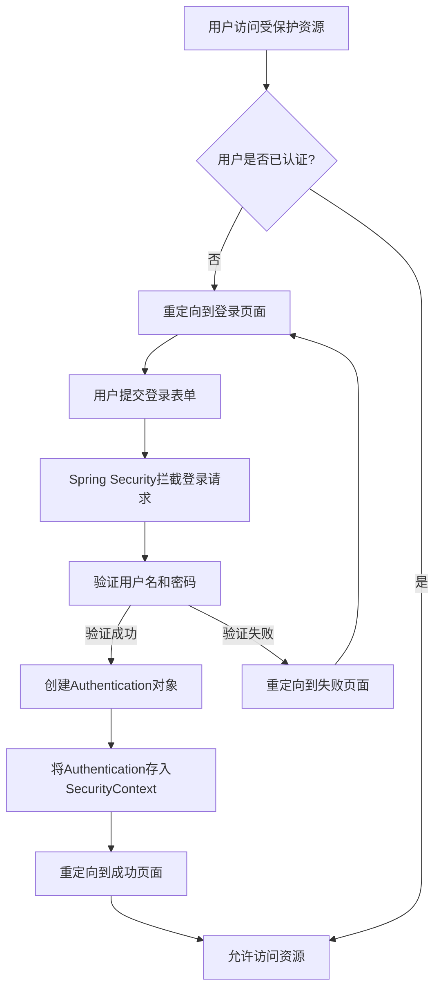
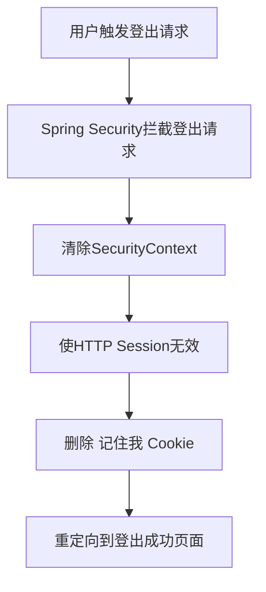

# Spring Security 基础流程

## 登录流程

当用户尝试访问受保护的资源或直接访问登录页面时，Spring Security 会处理整个认证过程。

### 登录流程详细说明

1. **访问受保护资源**: 用户尝试访问需要认证的资源
2. **检查认证状态**: Spring Security 检查当前 SecurityContext 中是否存在有效的 Authentication 对象
3. **重定向到登录页**: 如果用户未认证，重定向到配置的登录页面
4. **提交登录表单**: 用户在登录页面输入凭据并提交
5. **拦截登录请求**: `UsernamePasswordAuthenticationFilter` 拦截登录请求
6. **验证凭据**: `DaoAuthenticationProvider` 使用配置的 `UserDetailsService` 和 `PasswordEncoder` 验证凭据
7. **创建Authentication对象**: 验证成功后，创建包含用户信息和权限的 Authentication 对象
8. **存入SecurityContext**: 将 Authentication 对象存入 SecurityContext（通常存储在 HTTP Session 中）
9. **重定向到成功页面**: 重定向到登录成功后的默认页面或原始请求页面

## 登出流程

当用户触发登出操作时，Spring Security 会执行清理过程。

### 登出流程详细说明

1. **触发登出请求**: 用户点击登出链接或按钮，发送登出请求
2. **拦截登出请求**: `LogoutFilter` 拦截登出请求
3. **清除SecurityContext**: 从 SecurityContextHolder 中清除当前 Authentication 对象
4. **使Session无效**: 使当前 HTTP Session 无效，删除所有会话数据
5. **删除记住我Cookie**: 如果配置了记住我功能，删除相关的记住我 Cookie
6. **重定向到成功页面**: 重定向到登出成功后的页面（通常是登录页或首页）

## 核心组件

### 登录相关组件

- **UsernamePasswordAuthenticationFilter**: 处理基于表单的登录请求
- **DaoAuthenticationProvider**: 使用 UserDetailsService 验证用户凭据
- **UserDetailsService**: 加载用户特定数据的接口
- **PasswordEncoder**: 处理密码编码和验证
- **SecurityContext**: 存储当前认证用户信息
- **SecurityContextHolder**: 提供对 SecurityContext 的访问

### 登出相关组件

- **LogoutFilter**: 拦截登出请求
- **SecurityContextLogoutHandler**: 处理 SecurityContext 的清理
- **HttpSessionSecurityContextRepository**: 管理 SecurityContext 在 Session 中的存储